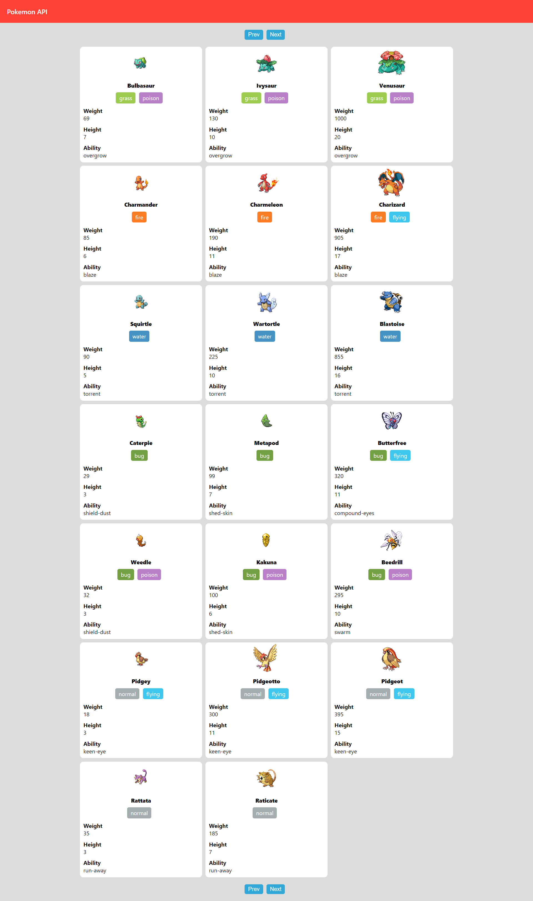

<div align="center">
	
</div>                                                              

<h3 align="center">POKEDEX</h3>

<h1 align="center">
	
</h1>  
<h2>Introduction</h2>
<p>Build pokemon information card using Pokemon API.</p>

<h2>Technologies</h2>
<ul>
<li>Reactjs</li>
<li>Pokemon API</li>
</ul>

<h2>API used</h2>

[Pokemon API](https://pokeapi.co/ "pokeapi")

<h2>How to Launch</h2>

To clone and run this application, From your command line:

```bash
# Clone this repository
$ git clone https://github.com/ganesh1172/pokedex.git

#install package
$ npm install

#run program using
$ npm start
```

## Support

Show some :heart: and star the repo to support the project. Demo version:- https://pokedox-card.netlify.app/


